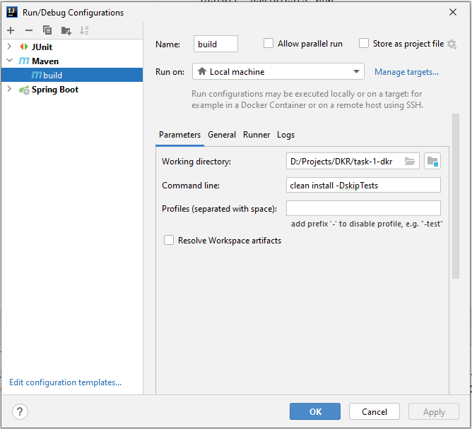
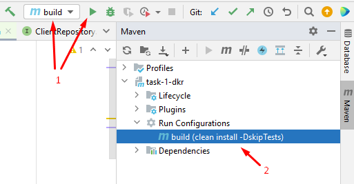
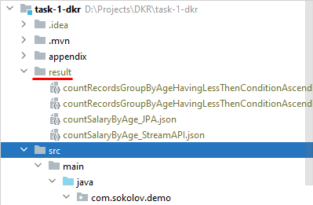

### Запуск проекта через Intellij IDEA

1. собрать проект в консоли командой `mvn clean install -DskipTests`
   или создать конфигурацию maven

и запустить её нажав кнопку 1 или 2 на скриншоте

2. запустить необходимый тест
3. посмотреть результаты тестов в папке **result**

